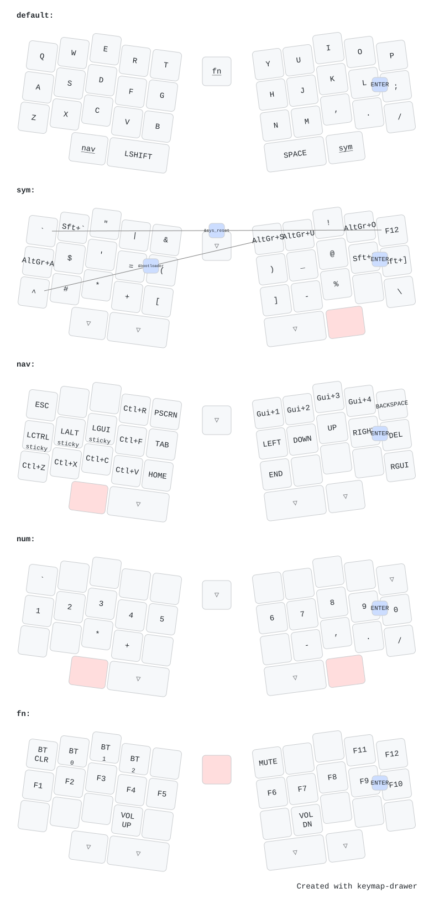
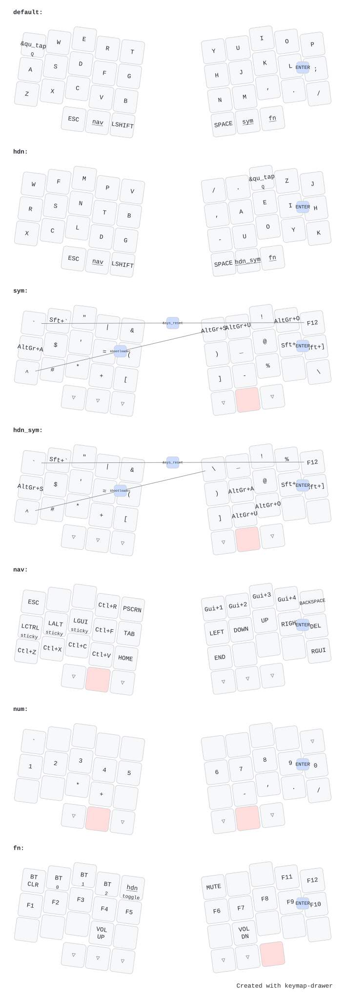

## ZMK Config

This started out as a fork from [jlw-zmk-config](https://github.com/josh-l-wang/jlw-zmk-config) but has since evolved to be very much specific to my workflow.

Le Jlwffre keymap

Elchibre keymap

